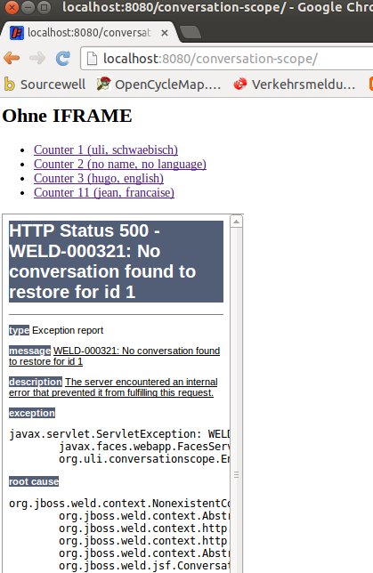
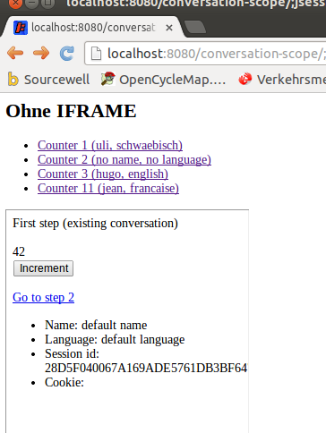

CONVERSATION SCOPE
==================

This is a small prototype using conversation scope java beans
in a web application. I'm testing the web application within
Tomcat-7.0.37 at the moment.

Building And Deploying The Project
----------------------------------

```
cd conversation-scope
../gradlew war
cp build/libs/conversation-scope.war /opt/apache-7.0.37/webapps/.
```

Using The Showcase
------------------

After deploying the project, you're able to look at the showcase.
The starting point is this: <http://localhost:8080/conversation-scope/>.
It shows a static html page. The page has a couple of links.
Each of this link is headed towards a servlet and contains specific
initialization parameters for the java beans.

The servlet

* creates a new conversation
* reads the parameters from the url
* stores the parameters within the java beans
* redirects the browser to a jsf page showing the content of the java beans

The main benefit of the conversation scope is the fact that you can
open multiple browser windows/tabs, each having a unique set of java beans.

Issues
------

### Redirect Without "cid=..."

Within the initial servlet, it is unclear if you are required to add the "cid"
when doing redirects. According to my tests, these are the findings:

* when the cid is added, the java beans are populated correctly
  (res.sendRedirect(req.getContextPath() + "/step1s.xhtml?cid="+conversation.getId());)
* without the cid, the java beans are empty
  (res.sendRedirect(req.getContextPath() + "/step1s.xhtml");)

So: You do have to specify the cid when doing redirects!

### Weld-1.1 vs. Weld 2.1

When using Weld-1.1.17.Final, I'm getting exceptions like this:

```
javax.enterprise.context.ContextNotActiveException: Conversation Context not active when method called on conversation Transient conversation
	org.jboss.weld.context.conversation.ConversationImpl.verifyConversationContextActive(ConversationImpl.java:197)
	org.jboss.weld.context.conversation.ConversationImpl.touch(ConversationImpl.java:159)
	org.jboss.weld.context.conversation.ConversationImpl.<init>(ConversationImpl.java:72)
	org.jboss.weld.bean.builtin.ConversationBean.create(ConversationBean.java:48)
	org.jboss.weld.bean.builtin.ConversationBean.create(ConversationBean.java:17)
	org.jboss.weld.context.AbstractContext.get(AbstractContext.java:103)
	org.jboss.weld.bean.proxy.ContextBeanInstance.getInstance(ContextBeanInstance.java:90)
	org.jboss.weld.bean.proxy.ProxyMethodHandler.invoke(ProxyMethodHandler.java:104)
	org.jboss.weld.proxies.Conversation$1990511612$Proxy$_$$_WeldClientProxy.begin(Conversation$1990511612$Proxy$_$$_WeldClientProxy.java)
	org.uli.conversationscope.UrlToUserContextBeanServlet.doGet(UrlToUserContextBeanServlet.java:37)
	javax.servlet.http.HttpServlet.service(HttpServlet.java:621)
	javax.servlet.http.HttpServlet.service(HttpServlet.java:728)
```

The exception doesn't happen when using Weld-2.1.2.Final.

### Circular dependencies

Circular dependencies between java beans don't seem to raise any issue.

```
// within CounterBean
@Inject UserContextBean userContextBean;

// within UserContextBean
@Inject CounterBean counterBean;
```

### BeanManager within context.xml

In the beginning, I've used this context.xml:

```
<?xml version="1.0" encoding="UTF-8"?>
<Context antiJARLocking="true" path="/os">
  <!-- disable storage of sessions across restarts -->
  <Manager pathname=""/>
  <Resource auth="Container" factory="org.jboss.weld.resources.ManagerObjectFac
  <!-- Uncomment to enable injection into Servlet -->
  <!--<Listener className="org.jboss.weld.environment.tomcat.WeldLifecycleListe
</Context>
```

However, it seems that this isn't strictly required, at least as long
as you don't use the BeanManager directly within your implementation.

### BeanManager within web.xml

Within web.xml, I've used this definition for the BeanManager:

```
 <resource-env-ref>
        <description>Object factory for the CDI Bean Manager</description>
        <resource-env-ref-name>BeanManager</resource-env-ref-name>
        <resource-env-ref-type>javax.enterprise.inject.spi.BeanManager</resource-env-ref-type>
  </resource-env-ref>
```

However, it seems that this isn't strictly required, at least as long
as you don't use the BeanManager directly within your implementation.

### WeldInitialListener  and WeldTerminalListener within web.xml

According to <http://docs.jboss.org/weld/reference/2.1.2.Final/en-US/html/environments.html#d0e5555>, you should add the WeldInitialListener and the
WeldTerminalListener to web.xml.

For me, this doesn't work out. I'm getting exceptions like these when
starting Tomcat:

```
Jan 24, 2014 8:35:59 AM org.apache.catalina.core.StandardContext listenerStart
SEVERE: Exception sending context initialized event to listener instance of class org.jboss.weld.servlet.WeldInitialListener
java.lang.IllegalStateException: Singleton is not set. Is your Thread.currentThread().getContextClassLoader() set correctly?
	at org.jboss.weld.bootstrap.api.helpers.IsolatedStaticSingletonProvider$IsolatedStaticSingleton.get(IsolatedStaticSingletonProvider.java:47)
	at org.jboss.weld.Container.instance(Container.java:55)
	at org.jboss.weld.Weld.getBeanManager(Weld.java:110)
	at org.jboss.weld.Weld.getBeanManager(Weld.java:45)
	at org.jboss.weld.servlet.WeldInitialListener.contextInitialized(WeldInitialListener.java:85)
	at org.apache.catalina.core.StandardContext.listenerStart(StandardContext.java:4797)
	at org.apache.catalina.core.StandardContext.startInternal(StandardContext.java:5291)
	at org.apache.catalina.util.LifecycleBase.start(LifecycleBase.java:150)
	at org.apache.catalina.core.ContainerBase.addChildInternal(ContainerBase.java:901)
	at org.apache.catalina.core.ContainerBase.addChild(ContainerBase.java:877)
	at org.apache.catalina.core.StandardHost.addChild(StandardHost.java:633)
	at org.apache.catalina.startup.HostConfig.deployWAR(HostConfig.java:977)
	at org.apache.catalina.startup.HostConfig$DeployWar.run(HostConfig.java:1655)
	at java.util.concurrent.Executors$RunnableAdapter.call(Executors.java:471)
	at java.util.concurrent.FutureTask$Sync.innerRun(FutureTask.java:334)
	at java.util.concurrent.FutureTask.run(FutureTask.java:166)
	at java.util.concurrent.ThreadPoolExecutor.runWorker(ThreadPoolExecutor.java:1146)
	at java.util.concurrent.ThreadPoolExecutor$Worker.run(ThreadPoolExecutor.java:615)
	at java.lang.Thread.run(Thread.java:701)
Jan 24, 2014 8:36:00 AM org.apache.catalina.core.StandardContext startInternal
SEVERE: Error listenerStart
Jan 24, 2014 8:36:00 AM org.apache.catalina.core.StandardContext startInternal
SEVERE: Context [/conversation-scope] startup failed due to previous errors
Jan 24, 2014 8:36:00 AM org.apache.catalina.core.StandardContext listenerStop
SEVERE: Exception sending context destroyed event to listener instance of class org.jboss.weld.servlet.WeldInitialListener
java.lang.NullPointerException
	at org.jboss.weld.servlet.WeldInitialListener.contextDestroyed(WeldInitialListener.java:120)
	at org.apache.catalina.core.StandardContext.listenerStop(StandardContext.java:4837)
	at org.apache.catalina.core.StandardContext.stopInternal(StandardContext.java:5483)
	at org.apache.catalina.util.LifecycleBase.stop(LifecycleBase.java:232)
	at org.apache.catalina.util.LifecycleBase.start(LifecycleBase.java:160)
	at org.apache.catalina.core.ContainerBase.addChildInternal(ContainerBase.java:901)
	at org.apache.catalina.core.ContainerBase.addChild(ContainerBase.java:877)
	at org.apache.catalina.core.StandardHost.addChild(StandardHost.java:633)
	at org.apache.catalina.startup.HostConfig.deployWAR(HostConfig.java:977)
	at org.apache.catalina.startup.HostConfig$DeployWar.run(HostConfig.java:1655)
	at java.util.concurrent.Executors$RunnableAdapter.call(Executors.java:471)
	at java.util.concurrent.FutureTask$Sync.innerRun(FutureTask.java:334)
	at java.util.concurrent.FutureTask.run(FutureTask.java:166)
	at java.util.concurrent.ThreadPoolExecutor.runWorker(ThreadPoolExecutor.java:1146)
	at java.util.concurrent.ThreadPoolExecutor$Worker.run(ThreadPoolExecutor.java:615)
	at java.lang.Thread.run(Thread.java:701)
```

Using the old listener documented in Weld-1.1 <http://docs.jboss.org/weld/reference/1.1.16.Final/en-US/html/environments.html#d0e5228>, everything seems to work OK.

### WELD-001408: Unsatisfied dependencies for type UserContextBean

When deploying the web application "conversation-scope.war" into
a tomcat of a customer of mine, exceptions like this show up:

```
Jan 28, 2014 7:54:35 AM org.apache.catalina.core.StandardContext loadOnStartup
SEVERE: Servlet /conversation-scope threw load() exception
org.jboss.weld.exceptions.DeploymentException: WELD-001408: Unsatisfied dependencies for type UserContextBean with qualifiers @Default
  at injection point [BackedAnnotatedField] @Inject org.uli.conversationscope.UrlToBeansServlet.userContextBean
  at org.uli.conversationscope.UrlToBeansServlet.userContextBean(UrlToBeansServlet.java:0)

	at org.jboss.weld.bootstrap.Validator.validateInjectionPointForDeploymentProblems(Validator.java:368)
	at org.jboss.weld.bootstrap.Validator.validateInjectionPoint(Validator.java:289)
	at org.jboss.weld.bootstrap.Validator.validateProducer(Validator.java:426)
	at org.jboss.weld.injection.producer.InjectionTargetService.validateProducer(InjectionTargetService.java:35)
	at org.jboss.weld.manager.InjectionTargetFactoryImpl.createInjectionTarget(InjectionTargetFactoryImpl.java:80)
	at org.jboss.weld.manager.InjectionTargetFactoryImpl.createInjectionTarget(InjectionTargetFactoryImpl.java:69)
...
```

After some analysis, it turns out that this error happens only when the war file is located
outside of the host's appbase, i.e. you have a file .../conf/Catalina/localhost/conversation-scope.xml
similar to this one:

```
<?xml version="1.0" encoding="UTF-8"?>
<Context docBase="/tmp/conversation-scope.war" 
         path="/conversation-scope"
         unpackWAR="true"
>
</Context>
```

I've reproduces the error with

* tomcat-7.0.42
* tomcat-7.0.47

The error doesn't happen with

* tomcat-7.0.50

In order to work OK with tomcat-7.0.50, be sure to set `unpackWAR="true"` for the context!

### Blocking of 3rd-Party-Cookies

Activate blocking of 3rd-party-cookies in your browser. For Safari, this is the default behavior.
For Chrome, do this:

* Einstellungen (Settings?)
* Erweiterte Einstellungen (Extended Settings?)
* Datenschutz - Inhaltseinstellungen (Security? - Content Settings?)
* Activate: Cookies - Drittanbieter-Cookies und Websitedaten blockieren (Block 3rd-party-cookies ?)

Within /etc/hosts, configure this:

    127.0.0.1       www.dp.biz

Now head your browser to <http://localhost:8080/conversation-scope>.

With the initial implementation, the browser displays something like this:



The fixed implementation leads to this display:


